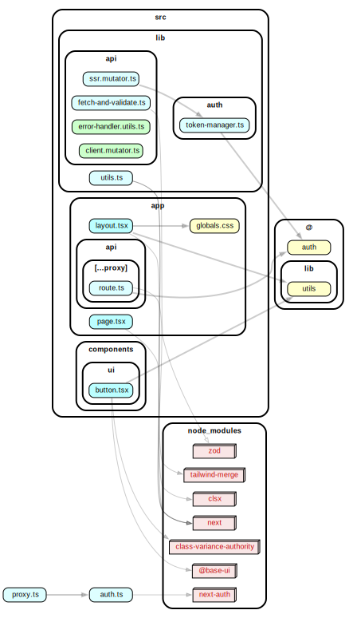

# BFF Pattern Template

A secure, scalable Next.js 16 template implementing the Backend-For-Frontend (BFF) pattern with NextAuth 5 (OAuth 2.1) and fully typed Orval generation for OpenAPI backends.

## System Architecture



This template connects a frontend application to a single upstream backend through a secure Next.js App Router API proxy. Authentication is managed via NextAuth (OAuth 2.1), and all API clients are strictly typed and auto-generated using Orval based on an OpenAPI schema.

## Get Started

To start vibe coding with this template, follow these exact steps:

1. **Provide OpenAPI Spec**: 
   Place your backend's `openapi.json` at the project root (or configure the remote URL in `orval.config.ts`).
2. **Generate API Clients**: 
   Run `bun run codegen`. This uses Orval to generate fully-typed React Query hooks, SSR fetchers, and Zod schemas in `src/lib/generated/`.
3. **Configure Authentication**: 
   Set up your OAuth 2.1 provider in `auth.ts` and populate the `.env` variables (use `.env.example` as a reference).
4. **Build the UI**: 
   Ask the AI agent to build out your UI components. The agent is instructed to read `AGENTS.md` which restricts it to using the generated code and enforcing the BFF architecture.
5. **Verify Architecture**: 
   Run `bun run arch:check` to ensure no boundaries (like leaking server secrets to the client) have been violated.

## Tech Stack (Locked)

- **Framework**: Next.js 16.2.10 (App Router, Node.js proxy)
- **Auth**: NextAuth.js 5.0.0-beta.31
- **API Codegen**: Orval (React Query + Zod)
- **Styling**: Tailwind CSS + shadcn/ui
- **Tooling**: Bun (package manager), Biome (lint/format), Dependency-cruiser (architecture enforcement)

## Architecture & System Design

Our complete architecture is documented using the C4 model. Please read these before writing code.

* [V03 — System Context](docs/design/v03-system-context.md)
* [V04 — Container Map](docs/design/v04-container-map.md)
* [V05 — Data Flows](docs/design/v05-data-flows.md)
* [V06 — Auth Flows](docs/design/v06-auth-flows.md)
* [V07 — BFF Proxy Component](docs/design/v07-bff-proxy-component.md)
* [V08 — Auth Layer Component](docs/design/v08-auth-layer-component.md)
* [V09 — Data Layer Component](docs/design/v09-data-layer-component.md)
* [V10 — Codegen Pipeline](docs/design/v10-codegen-pipeline.md)
* [V11 — Deployment](docs/design/v11-deployment.md)
* [V12 — Architecture Rules](docs/design/v12-architecture-rules.md)

## Development

```bash
bun install
# Verify architecture rules
bun run arch:check
```
