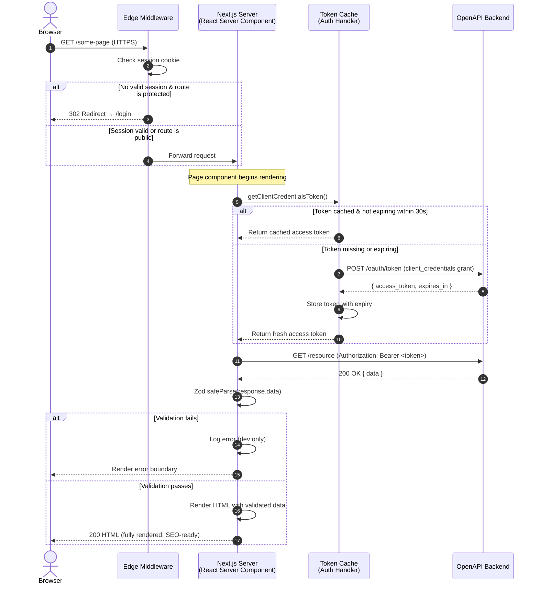
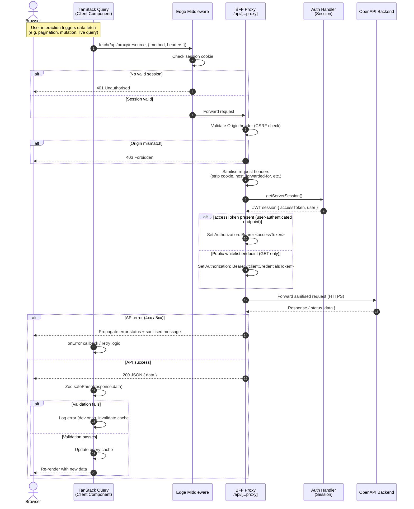

# V05 — SSR vs BFF Data Flow

> Render diagrams at https://mermaid.live

---

## Path A — SSR: Server Component fetches data directly



---

## Path B — BFF: Client Component fetches via proxy



---

## Side-by-Side Comparison

| Step | SSR Path | BFF Path |
|---|---|---|
| **Trigger** | Next.js render cycle (server) | User action / RQ hook (browser) |
| **Entry point** | `/some-page` → RSC | `fetch /api/[...proxy]/resource` |
| **Auth token source** | Token Cache (client credentials) | Auth Handler (user JWT session) |
| **CSRF check** | Not needed (server-to-server) | ✅ Required — Origin validation |
| **Header sanitisation** | Not needed | ✅ Required — strip sensitive headers |
| **API caller** | `nextServer` (ssr.mutator.ts) | `bffProxy` (client.mutator.ts) |
| **Validation** | Zod `safeParse` on server | Zod `safeParse` on client (via RQ) |
| **Error surface** | Next.js `error.tsx` boundary | RQ `onError` + component state |
| **Browser JS added** | None | RQ runtime + component bundle |
| **SEO** | ✅ Full — HTML served pre-rendered | ❌ No — rendered after fetch |
| **Use for** | Page data, initial load, SEO content | Mutations, interactive queries |

---

## Decision Rule (for template users)

```
Does this data need to be in the HTML for SEO?
  └─ YES → Use SSR path (Server Component + ssr.mutator)

Does this fetch happen in response to a user action?
  └─ YES → Use BFF path (Client Component + RQ hook + client.mutator)

Can this page be fully static (no per-request data)?
  └─ YES → Use generateStaticParams / ISR — no fetch at render time
```

---

## Design Notes

### Token cache prevents per-request OAuth round-trips (SSR path)
The 30-second expiry buffer ensures the token is refreshed proactively, not reactively. A reactive refresh would cause the first request after expiry to block while waiting for a new token, adding latency to page renders.

### CSRF protection is only on the BFF path
Server-to-server (SSR) requests originate inside the trusted server boundary — there is no browser origin to spoof. CSRF is only meaningful for browser-initiated requests.

### Public whitelist (BFF path, step 12)
Some GET endpoints are safe to expose with client credentials rather than requiring a user session (e.g. public content APIs). The whitelist is defined in `bffProxy` configuration — not hardcoded per route.

### Two mutators, one contract
Both paths call the same generated API clients (from Orval), but with different mutators:
- `ssr.mutator.ts` — injects client credentials, sets base URL, runs server-side only
- `client.mutator.ts` — points to `/api/[...proxy]/`, runs browser-side only, carries no secrets

The mutator swap is the only difference between SSR and RQ generated clients. This is a key design insight for template users.

---

> ✅ Approve to continue to **V06 — Auth Flows**.
> Or request changes to any step, actor, or decision rule.
