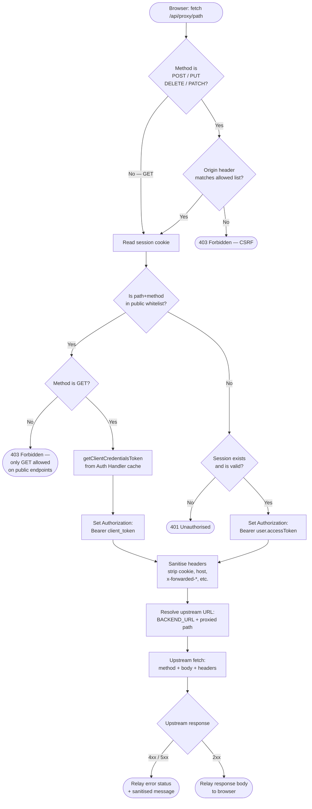

# V07 — BFF Proxy: Component View

---

## Structurizr DSL

```structurizr
workspace "bff-pattern" "BFF Proxy — Component View" {

    model {

        # ── External actors ─────────────────────────────────────────────────────
        browser = person "Browser" {
            description "Client Component or TanStack Query hook initiating the request."
            tags "External"
        }

        backendApi = softwareSystem "OpenAPI Backend" {
            description "Upstream REST API."
            tags "External"
        }

        # ── System boundary ─────────────────────────────────────────────────────
        bffApp = softwareSystem "bff-pattern App" {
            tags "Internal"

            authHandler = container "Auth Handler" {
                description "NextAuth.js session subsystem + client credentials token cache."
                technology "NextAuth.js 5"
                tags "Server"
            }

            bffProxy = container "BFF Proxy" {
                description "app/api/[...proxy]/route.ts — catch-all API route."
                technology "Next.js Route Handler, TypeScript"
                tags "Server"

                routeHandler = component "Route Handler" {
                    description "Entry point for all proxied requests. Extracts the target path from the [...proxy] catch-all segment. Orchestrates the processing pipeline and returns the upstream response to the browser."
                    technology "Next.js Route Handler (GET, POST, PUT, DELETE, PATCH)"
                    tags "Component"
                }

                csrfGuard = component "CSRF Guard" {
                    description "For state-changing methods (POST, PUT, DELETE, PATCH): validates the request Origin header against the application's configured allowed-origins list. Returns 403 on mismatch. GET requests bypass this check."
                    technology "TypeScript"
                    tags "Component"
                }

                sessionReader = component "Session Reader" {
                    description "Calls getServerSession(authConfig) to decode the user's HttpOnly JWT session cookie. Returns a session object with the user's access token, or null if no valid session exists."
                    technology "NextAuth.js getServerSession"
                    tags "Component"
                }

                publicWhitelist = component "Public Endpoint Whitelist" {
                    description "Checks whether the requested path+method combination is registered as a public endpoint in proxy.config.ts. Public endpoints (read-only GET) do not require a user session and are served with client credentials instead."
                    technology "TypeScript, config/proxy.config.ts"
                    tags "Component"
                }

                tokenInjector = component "Token Injector" {
                    description "Determines and attaches the Authorization header. (a) Authenticated endpoint: Bearer <session.user.accessToken>. (b) Public whitelisted endpoint: Bearer <clientCredentialsToken> fetched from Auth Handler's token cache."
                    technology "TypeScript"
                    tags "Component"
                }

                headerSanitizer = component "Header Sanitizer" {
                    description "Strips headers that must not reach the upstream API: cookie, host, x-forwarded-for, x-forwarded-proto, x-real-ip, connection, transfer-encoding. Prevents header injection and internal topology leakage."
                    technology "TypeScript"
                    tags "Component"
                }

                upstreamFetcher = component "Upstream Fetcher" {
                    description "Constructs and dispatches the upstream request: resolves target URL as BACKEND_URL + proxied path, merges sanitised request headers with the injected Authorization header, and forwards the method and body verbatim. Relays the upstream response (status, headers, body) to the browser."
                    technology "Bun fetch"
                    tags "Component"
                }
            }
        }

        # ── Relationships ───────────────────────────────────────────────────────
        browser -> routeHandler "fetch /api/[...proxy]/<path> [HTTPS]"

        routeHandler -> csrfGuard       "1. Check CSRF"
        csrfGuard -> sessionReader      "2. Read session"
        sessionReader -> publicWhitelist "3. Check whitelist"
        publicWhitelist -> tokenInjector "4. Inject token"
        tokenInjector -> headerSanitizer "5. Sanitise headers"
        headerSanitizer -> upstreamFetcher "6. Forward"
        upstreamFetcher -> backendApi   "7. Upstream call [HTTPS]"

        sessionReader -> authHandler    "getServerSession(authConfig)"
        tokenInjector -> authHandler    "getClientCredentialsToken() [public path only]"
    }

    views {

        component bffProxy "V5_BFFProxyComponent" {
            include *
            autoLayout tb
            title "V07 — BFF Proxy: Component View"
            description "The 7 processing components inside the BFF catch-all proxy route."
        }

        styles {
            element "Component" {
                background #1a6bcc
                color #ffffff
                shape Component
            }
            element "External" {
                background #6b7280
                color #ffffff
                shape RoundedBox
            }
            element "Server" {
                background #374151
                color #ffffff
                shape RoundedBox
            }
            element "Person" {
                background #374151
                color #ffffff
                shape Person
            }
            relationship "Relationship" {
                thickness 2
            }
        }

        theme default
    }
}
```

---

## Request Processing Pipeline (Decision Flowchart)



---

## Component → File Placement

| Component | File path |
|---|---|
| Route Handler | `app/api/[...proxy]/route.ts` |
| CSRF Guard | `lib/proxy/csrf.guard.ts` |
| Session Reader | `lib/proxy/session.reader.ts` |
| Public Endpoint Whitelist | `config/proxy.config.ts` + `lib/proxy/whitelist.ts` |
| Token Injector | `lib/proxy/token.injector.ts` |
| Header Sanitizer | `lib/proxy/header.sanitizer.ts` |
| Upstream Fetcher | `lib/proxy/upstream.fetcher.ts` |

---

## Design Notes

### Pipeline order is load-bearing
The order of the 7 steps is not arbitrary:
1. **CSRF before session read** — avoids a session-read on invalid origins
2. **Whitelist after session read** — whitelist decision needs to know whether a session exists
3. **Token injection before header sanitization** — ensures the Authorization header is clean before stripping occurs
4. **Sanitization before fetch** — the boundary where all internal information is stripped

### The whitelist is config, not code
`config/proxy.config.ts` holds the list of public endpoints as data:
```ts
export const PUBLIC_PROXY_ENDPOINTS = [
  { path: '/posts', method: 'GET' },
  { path: '/categories', method: 'GET' },
]
```
Adding a new public endpoint requires **no code change** to the proxy pipeline — only a config entry. This is intentional to reduce the surface area for security mistakes.

### Header sanitization — what gets stripped
| Header | Reason stripped |
|---|---|
| `cookie` | Session cookie must not reach the upstream API |
| `host` | Reveals internal hostname |
| `x-forwarded-for` | Reveals client IP (may violate privacy policy) |
| `x-forwarded-proto` | Internal transport detail |
| `x-real-ip` | Reveals client IP |
| `connection` | Hop-by-hop header, invalid for upstream |
| `transfer-encoding` | Managed by Bun fetch automatically |

### Response relay — what does NOT get sanitized outbound
The upstream response is relayed as-is (status code, body). Response headers are forwarded except for hop-by-hop headers (`connection`, `transfer-encoding`, `keep-alive`). Content-Type, Cache-Control, and ETag are preserved.

---

> ✅ Approve to continue to **V08 — Auth Layer Component** (C4 L3).
> Or request changes to components, pipeline order, or file placement.
