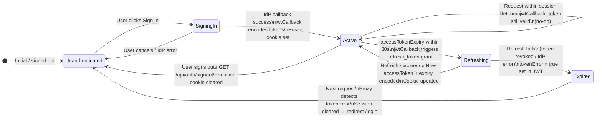

# V08 — Auth Layer: Component View

---

## Structurizr DSL

```structurizr
workspace "bff-pattern" "Auth Layer — Component View" {

    model {

        # ── External actors ─────────────────────────────────────────────────────
        browser = person "Browser" {
            description "End user navigating login, callback, session, and logout flows."
            tags "External"
        }

        identityProvider = softwareSystem "Identity Provider" {
            description "OAuth 2.1 authorization server."
            tags "External"
        }

        # ── System boundary ─────────────────────────────────────────────────────
        bffApp = softwareSystem "bff-pattern App" {
            tags "Internal"

            proxyContainer = container "Proxy" {
                description "proxy.ts — calls auth() to apply coarse-grained route protection before app and API handlers run."
                technology "Next.js Proxy, Node.js Runtime"
                tags "Server"
            }

            bffProxy = container "BFF Proxy" {
                description "app/api/[...proxy]/route.ts — server-side proxy for browser-initiated API calls."
                technology "Next.js Route Handler"
                tags "Server"
            }

            nextServer = container "Next.js Server" {
                description "React Server Components and server-side rendering."
                technology "Next.js 16, RSC"
                tags "Server"
            }

            authHandler = container "Auth Handler" {
                description "NextAuth.js 5 — session management, OAuth callbacks, and token lifecycle."
                technology "NextAuth.js 5.0.0-beta.31, OAuth 2.1, JWT"
                tags "Server"

                routeHandler = component "Auth Route Handler" {
                    description "Mounts NextAuth GET and POST handlers at app/api/auth/[...nextauth]/route.ts. Entry point for sign-in, sign-out, callback, session, and CSRF token requests."
                    technology "Next.js Route Handler, NextAuth handlers"
                    tags "Component"
                }

                oauthProviderConfig = component "OAuth Provider Config" {
                    description "Declares the OAuth provider settings: issuer, client ID, client secret, scopes, authorization URL, token URL, and profile mapping."
                    technology "NextAuth Provider config, auth.ts"
                    tags "Component"
                }

                jwtCallback = component "JWT Callback" {
                    description "Runs during sign-in and session access. Stores token metadata in the signed JWT and performs refresh when the access token approaches expiry."
                    technology "TypeScript, callbacks.jwt in auth.ts"
                    tags "Component"
                }

                sessionCallback = component "Session Callback" {
                    description "Shapes the safe session object returned by auth() / getServerSession(). Exposes user-facing session fields and error state, not raw tokens."
                    technology "TypeScript, callbacks.session in auth.ts"
                    tags "Component"
                }

                authorizedCallback = component "Authorized Callback" {
                    description "Runs inside auth() from proxy.ts. Decides whether the current request is public, protected, redirected, or allowed."
                    technology "TypeScript, callbacks.authorized in auth.ts"
                    tags "Component"
                }

                tokenManager = component "Token Manager" {
                    description "Manages the server-side client-credentials token independently of user sessions. Maintains an in-memory token cache and refreshes proactively."
                    technology "TypeScript, src/lib/auth/token-manager.ts"
                    tags "Component"
                }
            }
        }

        # ── Relationships ───────────────────────────────────────────────────────

        browser -> routeHandler "GET/POST /api/auth/*"

        routeHandler -> oauthProviderConfig "Reads provider settings"
        routeHandler -> jwtCallback "Invokes on token creation / refresh"
        jwtCallback -> sessionCallback "Provides JWT payload for session shaping"

        routeHandler -> identityProvider "Redirects browser for authorization"
        jwtCallback -> identityProvider "POST /token (refresh_token grant)"
        tokenManager -> identityProvider "POST /token (client_credentials grant)"

        proxyContainer -> authorizedCallback "auth() — route protection check"
        bffProxy -> sessionCallback "auth() / getServerSession() — read safe session"
        nextServer -> sessionCallback "auth() / getServerSession() — read safe session"
        nextServer -> tokenManager "getClientCredentialsToken() — SSR calls"
        bffProxy -> tokenManager "getClientCredentialsToken() — public whitelist"
    }

    views {

        component authHandler "V6_AuthLayerComponent" {
            include *
            autoLayout tb
            title "V08 — Auth Layer: Component View"
            description "The six components inside the Auth Handler and their consumers."
        }

        styles {
            element "Component" {
                background #1a6bcc
                color #ffffff
                shape Component
            }
            element "External" {
                background #6b7280
                color #ffffff
                shape RoundedBox
            }
            element "Server" {
                background #374151
                color #ffffff
                shape RoundedBox
            }
            element "Person" {
                background #374151
                color #ffffff
                shape Person
            }
            relationship "Relationship" {
                thickness 2
            }
        }

        theme default
    }
}
```

---

## Session Lifecycle — State Diagram



---

## Callback Reference Table

| Callback | File | Fires when | Input | Output |
|---|---|---|---|---|
| `jwt()` | `auth.ts` | Sign-in; session access; token refresh | Raw IdP tokens + existing JWT | Updated JWT stored in the session cookie |
| `session()` | `auth.ts` | Safe session is read | JWT payload | Safe session object without raw tokens |
| `authorized()` | `auth.ts` | `proxy.ts` calls `auth()` | Session + request | `true` / `false` route decision |

---

## Component → File Placement

| Component | File |
|---|---|
| Auth Route Handler | `src/app/api/auth/[...nextauth]/route.ts` |
| OAuth Provider Config | `auth.ts` → `providers[]` |
| JWT Callback | `auth.ts` → `callbacks.jwt` |
| Session Callback | `auth.ts` → `callbacks.session` |
| Authorized Callback | `auth.ts` → `callbacks.authorized` |
| Token Manager | `src/lib/auth/token-manager.ts` |
| NextAuth initializer | `auth.ts` exports `auth`, `handlers`, `signIn`, `signOut` |
| Request proxy | `proxy.ts` exports `proxy = auth` |

---

## Design Notes

### `authorized()` belongs to the proxy boundary

`authorized()` is not a page-level authorization mechanism. It is the coarse request gate called by `proxy.ts`. It decides whether a request may enter the application or must be redirected/blocked. Fine-grained authorization still belongs in Server Components, route handlers, or backend APIs.

### Session callback never exposes raw tokens

The `session()` callback returns a safe session shape. Browser-readable session data must not contain raw access tokens, refresh tokens, client secrets, or backend URLs.

### Token Manager is independent of user sessions

`token-manager.ts` handles client-credentials tokens for server-side calls. It has no dependency on browser sessions and can be tested independently.

### Next.js 16 Proxy runs on Node.js

This design uses `proxy.ts`, not legacy `middleware.ts`. The proxy calls `auth()` directly and runs in the Node.js runtime, so the auth configuration can remain consolidated in `auth.ts`.
