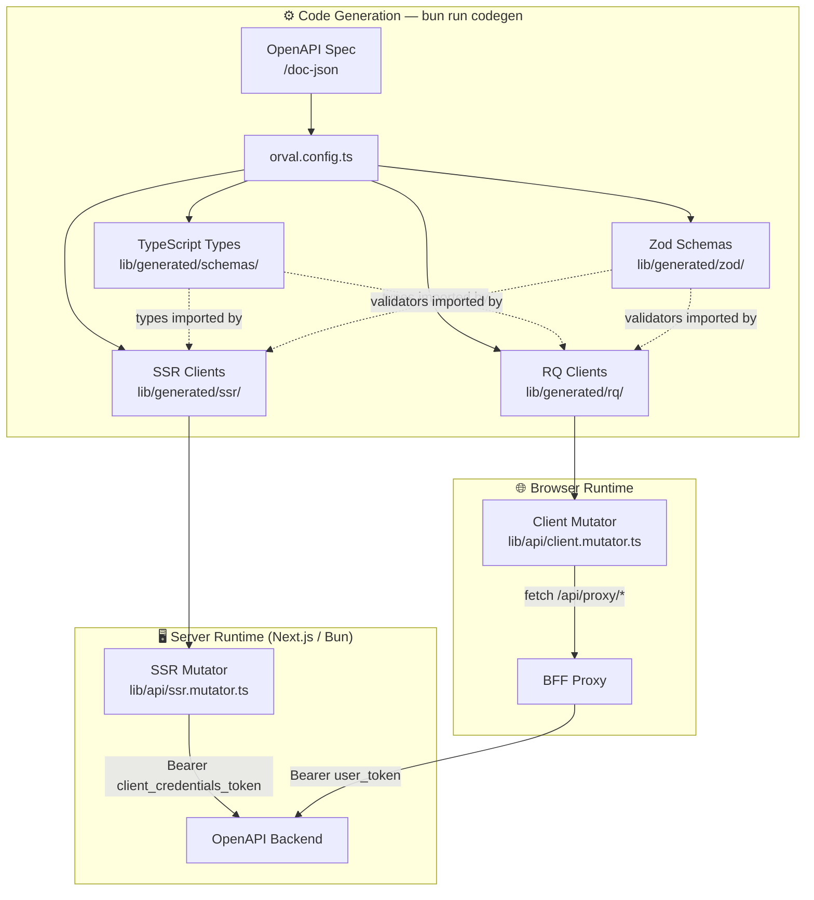

# V09 — Data Layer: Component View

---

## Structurizr DSL

> **Note on container modelling:** The data layer spans two runtime environments (server and browser). For C4 L3 clarity it is modelled here as a single logical container with components tagged by their runtime boundary. It does not represent a separate deployable process.

```structurizr
workspace "bff-pattern" "Data Layer — Component View" {

    model {

        # ── External systems ────────────────────────────────────────────────────
        backendApi = softwareSystem "OpenAPI Backend" {
            tags "External"
        }

        identityProvider = softwareSystem "Identity Provider" {
            tags "External"
        }

        bffApp = softwareSystem "bff-pattern App" {
            tags "Internal"

            authHandler = container "Auth Handler" {
                description "Token Manager — provides client credentials token."
                technology "NextAuth.js 5"
                tags "Server"
            }

            bffProxy = container "BFF Proxy" {
                description "Catch-all proxy — receives client.mutator requests."
                technology "Next.js Route Handler"
                tags "Server"
            }

            dataLayer = container "Data Layer" {
                description "Orval-generated API clients and hand-written mutators. NOT a separate process — components run in Next.js Server or Browser depending on their tag."
                technology "TypeScript, Orval, Zod 4, TanStack Query"
                tags "DataLayer"

                # ── Generated artefacts (DO NOT EDIT) ──────────────────────────
                tsTypes = component "TypeScript Types" {
                    description "Generated TypeScript interfaces and type aliases for all API request/response shapes. Single source of truth for the API contract. DO NOT EDIT — regenerate with `bun run codegen`."
                    technology "Orval → lib/generated/schemas/"
                    tags "Generated" "Shared"
                }

                zodSchemas = component "Zod Schemas" {
                    description "Generated Zod validators mirroring every TypeScript type. Used for runtime validation of API responses in both SSR and BFF paths. DO NOT EDIT."
                    technology "Orval + @orval/zod → lib/generated/zod/"
                    tags "Generated" "Shared"
                }

                ssrClients = component "SSR Clients" {
                    description "Generated server-side fetch functions for every API endpoint. Import and call directly from React Server Components. Each function uses ssr.mutator.ts for HTTP transport. DO NOT EDIT."
                    technology "Orval → lib/generated/ssr/"
                    tags "Generated" "Server"
                }

                rqClients = component "RQ Clients" {
                    description "Generated TanStack React Query hooks for every API endpoint. Used inside Client Components. Each hook uses client.mutator.ts which routes requests through the BFF proxy. DO NOT EDIT."
                    technology "Orval → lib/generated/rq/"
                    tags "Generated" "Client"
                }

                # ── Hand-written (EDIT as needed) ──────────────────────────────
                ssrMutator = component "SSR Mutator" {
                    description "Hand-written HTTP adapter for SSR Clients. Resolves base URL from BACKEND_URL env var (server-only). Fetches and injects the client credentials Bearer token from Token Manager. Runs on the server only — never bundled to the browser."
                    technology "TypeScript, Bun fetch — lib/api/ssr.mutator.ts"
                    tags "HandWritten" "Server"
                }

                clientMutator = component "Client Mutator" {
                    description "Hand-written HTTP adapter for RQ Clients. Routes all calls to /api/[...proxy]/ (the BFF Proxy) instead of directly to the backend. Carries no secrets. Safe to run in the browser bundle."
                    technology "TypeScript, browser fetch — lib/api/client.mutator.ts"
                    tags "HandWritten" "Client"
                }

                fetchAndValidate = component "Fetch and Validate" {
                    description "Utility that wraps an SSR Client call with Zod validation. Combines the fetch and safeParse steps. Returns validated data or throws a typed ValidationError. Used by Server Components that need a single-expression fetch+validate pattern."
                    technology "TypeScript — lib/api/fetch-and-validate.ts"
                    tags "HandWritten" "Server"
                }

                errorHandler = component "Error Handler" {
                    description "Normalises API errors across both paths into a consistent ApiError shape { status, message, details }. Used by Server Components and the BFF Proxy to avoid exposing raw upstream error payloads."
                    technology "TypeScript — lib/api/error-handler.utils.ts"
                    tags "HandWritten" "Shared"
                }
            }
        }

        # ── Relationships ───────────────────────────────────────────────────────

        # SSR path
        ssrClients    -> ssrMutator       "Uses for HTTP transport"
        ssrMutator    -> authHandler      "getClientCredentialsToken()"
        ssrMutator    -> backendApi       "Direct REST call [server-side]"
        fetchAndValidate -> ssrClients    "Wraps with Zod validation"
        fetchAndValidate -> zodSchemas    "Validates response"

        # RQ / BFF path
        rqClients     -> clientMutator    "Uses for HTTP transport"
        clientMutator -> bffProxy         "fetch /api/[...proxy]/* [browser]"

        # Shared
        ssrClients    -> tsTypes          "Import request/response types"
        rqClients     -> tsTypes          "Import request/response types"
        ssrClients    -> zodSchemas       "Import validators"
        rqClients     -> zodSchemas       "Import validators"
        errorHandler  -> ssrMutator       "Normalises upstream errors"
        errorHandler  -> clientMutator    "Normalises upstream errors"
    }

    views {

        component dataLayer "V7_DataLayerComponent" {
            include *
            autoLayout tb
            title "V09 — Data Layer: Component View"
            description "Generated API clients, Zod schemas, and hand-written mutators."
        }

        styles {
            element "Generated" {
                background #b45309
                color #ffffff
                shape Component
            }
            element "HandWritten" {
                background #1a6bcc
                color #ffffff
                shape Component
            }
            element "External" {
                background #6b7280
                color #ffffff
                shape RoundedBox
            }
            element "Server" {
                border dashed
            }
            element "Client" {
                border dotted
            }
            element "Person" {
                background #374151
                color #ffffff
                shape Person
            }
            relationship "Relationship" {
                thickness 2
            }
        }

        theme default
    }
}
```

---

## The Two-Mutator Pattern



---

## Server / Client Boundary Table

| Component | Runs on | Bundle target | Contains secrets? | Imports allowed from |
|---|---|---|---|---|
| TypeScript Types | Build-time only | Both | ❌ | Anywhere |
| Zod Schemas | Build-time + runtime | Both | ❌ | Anywhere |
| SSR Clients | Server | Server only | ❌ (secrets via mutator) | Server Components, `fetch-and-validate` |
| RQ Clients | Browser | Client bundle | ❌ | `use client` components only |
| SSR Mutator | Server | Server only | ✅ (reads `BACKEND_URL`, injects token) | `lib/api/` only |
| Client Mutator | Browser | Client bundle | ❌ | `lib/api/` only |
| Fetch and Validate | Server | Server only | ❌ | Server Components |
| Error Handler | Both | Both | ❌ | Anywhere |

---

## Component → File Placement

| Component | File / Directory |
|---|---|
| TypeScript Types | `lib/generated/schemas/` ← **DO NOT EDIT** |
| Zod Schemas | `lib/generated/zod/` ← **DO NOT EDIT** |
| SSR Clients | `lib/generated/ssr/` ← **DO NOT EDIT** |
| RQ Clients | `lib/generated/rq/` ← **DO NOT EDIT** |
| SSR Mutator | `lib/api/ssr.mutator.ts` |
| Client Mutator | `lib/api/client.mutator.ts` |
| Fetch and Validate | `lib/api/fetch-and-validate.ts` |
| Error Handler | `lib/api/error-handler.utils.ts` |
| Orval config | `orval.config.ts` (root) |

> `lib/generated/` is gitignored or regenerated on deploy. It is never edited by hand.

---

## Design Notes

### The mutator is the seam — nothing else changes
Orval generates two client sets from the same spec. The only configuration difference is which mutator they point to. This is set in `orval.config.ts`:

```ts
// orval.config.ts (simplified)
export default {
  'ssr-client': {
    output: { target: 'lib/generated/ssr/', mutator: 'lib/api/ssr.mutator.ts' }
  },
  'rq-client': {
    output: { target: 'lib/generated/rq/', httpClient: 'axios', mutator: 'lib/api/client.mutator.ts' }
  },
  'zod-schemas': {
    output: { target: 'lib/generated/zod/', client: 'zod' }
  }
}
```

### `lib/generated/` is a build artefact, not source
Template users should run `bun run codegen` after:
- Initial setup (backend URL configured)
- Any backend API change
- Deployment pipeline (before `bun run build`)

### `fetch-and-validate` reduces Server Component boilerplate
Without it, every RSC needs three lines: fetch, safeParse, handle error. With it:
```ts
const data = await fetchAndValidate(
  () => getPostsSSR({ domain }),
  postsResponseSchema
)
```

### `error-handler` prevents upstream error leakage
Raw upstream errors may contain internal stack traces, service names, or database details. The Error Handler normalises all errors to `{ status, message }` before they propagate to the browser or `error.tsx`.

---

> ✅ Approve to continue to **V12 — Codegen Pipeline**.
> Or request changes to components, boundaries, or the mutator pattern.
