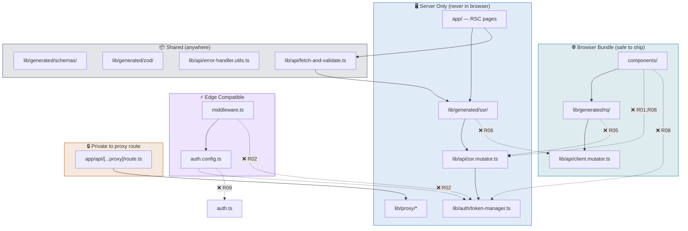

# V10 — Architecture Rules

> **sysande view 10 of 10.** Final view.
> Rules are machine-enforceable via `dependency-cruiser`. Run: `bun run arch:check`

---

## Rules Overview

| # | Rule name | Severity | Prohibits | Derived from |
|---|---|---|---|---|
| R01 | `ssr-mutator-server-only` | error | Importing `ssr.mutator.ts` from `components/` or `lib/generated/rq/` | V3, V7 |
| R02 | `token-manager-server-only` | error | Importing `token-manager.ts` from `auth.config.ts`, `middleware.ts`, or `components/` | V4, V6, V9 |
| R03 | `auth-config-edge-safe` | error | Importing Node.js built-ins from `auth.config.ts` | V6, V9 |
| R04 | `proxy-internals-private` | error | Importing `lib/proxy/*` from anywhere except `app/api/[...proxy]/` | V5 |
| R05 | `rq-uses-client-mutator-only` | error | `lib/generated/rq/` importing `ssr.mutator.ts` | V3, V7 |
| R06 | `ssr-uses-ssr-mutator-only` | error | `lib/generated/ssr/` importing `client.mutator.ts` | V3, V7 |
| R07 | `generated-no-app-imports` | error | `lib/generated/*` importing from `app/` or `components/` | V7 |
| R08 | `client-components-no-server-secrets` | error | `components/` importing `ssr.mutator.ts` or `token-manager.ts` | V2, V3 |
| R09 | `no-auth-ts-in-edge-files` | error | `auth.ts` (Node.js init) imported from `middleware.ts` or `auth.config.ts` | V6 |
| R10 | `no-direct-generated-in-pages` | warn | `app/` importing directly from `lib/generated/` bypassing `lib/api/` | V7 |

---

## Dependency Boundary Map



---

## `.dependency-cruiser.cjs`

```js
// .dependency-cruiser.cjs
/** @type {import('dependency-cruiser').IConfiguration} */
module.exports = {
  forbidden: [

    // ── R01: SSR mutator is server-only ────────────────────────────────────
    {
      name: 'ssr-mutator-server-only',
      comment:
        'ssr.mutator.ts reads server env vars and injects OAuth tokens. ' +
        'It must never be imported in client components or RQ clients.',
      severity: 'error',
      from: {
        path: '^(components/|lib/generated/rq/)',
      },
      to: {
        path: '^lib/api/ssr\\.mutator\\.ts$',
      },
    },

    // ── R02: Token manager is Node.js-only ─────────────────────────────────
    {
      name: 'token-manager-server-only',
      comment:
        'token-manager.ts uses in-memory Node.js state. ' +
        'It must not be imported from Edge-runtime files (auth.config.ts, middleware.ts) ' +
        'or from client components.',
      severity: 'error',
      from: {
        path: '^(auth\\.config\\.ts$|middleware\\.ts$|components/)',
      },
      to: {
        path: '^lib/auth/token-manager\\.ts$',
      },
    },

    // ── R03: auth.config.ts must remain Edge-compatible ────────────────────
    {
      name: 'auth-config-edge-safe',
      comment:
        'auth.config.ts runs in the Vercel Edge Runtime. ' +
        'It must not import Node.js core modules.',
      severity: 'error',
      from: {
        path: '^auth\\.config\\.ts$',
      },
      to: {
        dependencyTypes: ['core'],
      },
    },

    // ── R04: lib/proxy/ components are private to the proxy route ──────────
    {
      name: 'proxy-internals-private',
      comment:
        'lib/proxy/ components (CSRF guard, header sanitizer, etc.) are internal ' +
        'to app/api/[...proxy]/route.ts. They must not be imported elsewhere to ' +
        'prevent accidental reuse outside the security pipeline.',
      severity: 'error',
      from: {
        pathNot: '^app/api/\\[\\.\\.\\.'  + 'proxy\\]/route\\.ts$',
      },
      to: {
        path: '^lib/proxy/',
      },
    },

    // ── R05: RQ clients must use client.mutator only ────────────────────────
    {
      name: 'rq-uses-client-mutator-only',
      comment:
        'Generated RQ (TanStack Query) clients must route through the BFF proxy ' +
        'via client.mutator.ts. Importing ssr.mutator.ts would bypass the proxy ' +
        'and expose server credentials to the browser bundle.',
      severity: 'error',
      from: {
        path: '^lib/generated/rq/',
      },
      to: {
        path: '^lib/api/ssr\\.mutator\\.ts$',
      },
    },

    // ── R06: SSR clients must use ssr.mutator only ──────────────────────────
    {
      name: 'ssr-uses-ssr-mutator-only',
      comment:
        'Generated SSR clients must call the backend directly via ssr.mutator.ts. ' +
        'Importing client.mutator.ts would route server calls through the BFF proxy — ' +
        'a circular and inefficient path.',
      severity: 'error',
      from: {
        path: '^lib/generated/ssr/',
      },
      to: {
        path: '^lib/api/client\\.mutator\\.ts$',
      },
    },

    // ── R07: Generated files must not import from app/ or components/ ───────
    {
      name: 'generated-no-app-imports',
      comment:
        'lib/generated/ is a build artefact. It must not import from app/ or ' +
        'components/ — doing so would create a circular dependency and couple ' +
        'the generated API layer to application code.',
      severity: 'error',
      from: {
        path: '^lib/generated/',
      },
      to: {
        path: '^(app/|components/)',
      },
    },

    // ── R08: Client components must not access server secrets ───────────────
    {
      name: 'client-components-no-server-secrets',
      comment:
        'components/ may be rendered as client components. They must never ' +
        'directly import server-only utilities that read secrets or hold ' +
        'server-side state.',
      severity: 'error',
      from: {
        path: '^components/',
      },
      to: {
        path: '^(lib/api/ssr\\.mutator\\.ts$|lib/auth/token-manager\\.ts$)',
      },
    },

    // ── R09: auth.ts (Node.js) must not be imported in edge files ───────────
    {
      name: 'no-auth-ts-in-edge-files',
      comment:
        'auth.ts calls NextAuth() with Node.js dependencies. ' +
        'auth.config.ts and middleware.ts run in the Edge Runtime and must ' +
        'only import from auth.config.ts, never from auth.ts.',
      severity: 'error',
      from: {
        path: '^(middleware\\.ts$|auth\\.config\\.ts$)',
      },
      to: {
        path: '^auth\\.ts$',
      },
    },

    // ── R10: app/ pages should not bypass lib/api/ to import generated code ─
    {
      name: 'no-direct-generated-in-pages',
      comment:
        'Prefer importing SSR clients via lib/api/fetch-and-validate.ts ' +
        'rather than directly from lib/generated/ssr/. ' +
        'Direct imports are allowed but discouraged — they skip the error-handling wrapper.',
      severity: 'warn',
      from: {
        path: '^app/',
      },
      to: {
        path: '^lib/generated/(ssr|rq)/',
      },
    },
  ],

  options: {
    doNotFollow: {
      path: 'node_modules',
    },
    tsPreCompilationDeps: true,
    enhancedResolveOptions: {
      exportsFields: ['exports'],
      conditionNames: ['import', 'require', 'node', 'default'],
    },
    reporterOptions: {
      dot: {
        collapsePattern: 'node_modules/[^/]+',
      },
      archi: {
        collapsePattern:
          '^(node_modules|lib/generated|components/ui)/[^/]+',
      },
    },
  },
}
```

---

## `package.json` Scripts

```json
{
  "scripts": {
    "arch:check":  "depcruise --config .dependency-cruiser.cjs app lib components auth.config.ts auth.ts middleware.ts",
    "arch:graph":  "depcruise --config .dependency-cruiser.cjs --output-type dot app lib components | dot -T svg > docs/architecture-graph.svg",
    "arch:archi":  "depcruise --config .dependency-cruiser.cjs --output-type archi app lib components | dot -T svg > docs/architecture-overview.svg"
  }
}
```

---

## CI Integration (Husky pre-push hook)

```sh
# .husky/pre-push
#!/usr/bin/env sh
. "$(dirname -- "$0")/_/husky.sh"

bun run arch:check
```

> Architecture violations block `git push`. They never reach the remote.
> `bun run arch:check` exits with code `1` on any `error`-severity violation, `0` on `warn`-only.

---

## Rules-to-Views Traceability

| Rule | Architecture decision documented in |
|---|---|
| R01 `ssr-mutator-server-only` | V3 (two paths), V7 (two-mutator pattern) |
| R02 `token-manager-server-only` | V4 (client credentials), V6 (Edge constraint), V9 (runtime) |
| R03 `auth-config-edge-safe` | V6 (Edge-compatible split), V9 (Edge Runtime constraints) |
| R04 `proxy-internals-private` | V5 (pipeline order, encapsulation) |
| R05 `rq-uses-client-mutator-only` | V3 (BFF path), V7 (mutator config) |
| R06 `ssr-uses-ssr-mutator-only` | V3 (SSR path), V7 (mutator config) |
| R07 `generated-no-app-imports` | V7 (generated as build artefact) |
| R08 `client-components-no-server-secrets` | V2 (browser has no backend line), V3 (BFF guarantee) |
| R09 `no-auth-ts-in-edge-files` | V6 (auth.config.ts vs auth.ts split) |
| R10 `no-direct-generated-in-pages` | V7 (fetch-and-validate wrapper) |

---

## Design Notes

### Rules are derived from views, not invented
Every rule traces back to a specific architectural decision already documented in V2–V9. Dependency-cruiser config is the **executable form** of those decisions — not a separate concern.

### Warn vs Error
`error` = a rule whose violation breaks the security model or causes a runtime failure.
`warn` = a rule whose violation is a code quality concern but not a security risk.
R10 is `warn` because importing directly from `lib/generated/ssr/` is valid TypeScript and not a security issue — it just skips the error-handling wrapper.

### `tsPreCompilationDeps: true`
This tells dependency-cruiser to analyse TypeScript imports before compilation, following `paths` aliases and `tsconfig.json` configuration. Without this, aliased imports (`@/lib/...`) are not resolved correctly.

### Generating the architecture graph
`bun run arch:graph` produces a visual SVG of the entire dependency graph with violations highlighted. This is useful to include in the template's `docs/` as a living architecture diagram.

---

> ✅ All 10 views complete. Proceed to **cross-view consistency review**.
