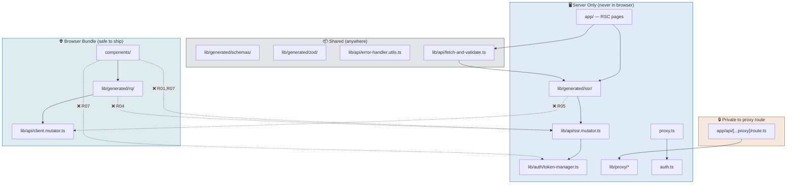

# V10 — Architecture Rules

---

## Rules Overview

| # | Rule name | Severity | Prohibits | Derived from |
|---|---|---|---|---|
| R01 | `ssr-mutator-server-only` | error | Importing `ssr.mutator.ts` from `components/` or `lib/generated/rq/` | V3, V7 |
| R02 | `token-manager-server-only` | error | Importing `token-manager.ts` from `components/` | V4, V6, V9 |
| R03 | `proxy-internals-private` | error | Importing `lib/proxy/*` from anywhere except `app/api/[...proxy]/` | V5 |
| R04 | `rq-uses-client-mutator-only` | error | `lib/generated/rq/` importing `ssr.mutator.ts` | V3, V7 |
| R05 | `ssr-uses-ssr-mutator-only` | error | `lib/generated/ssr/` importing `client.mutator.ts` | V3, V7 |
| R06 | `generated-no-app-imports` | error | `lib/generated/*` importing from `app/` or `components/` | V7 |
| R07 | `client-components-no-server-secrets` | error | `components/` importing `ssr.mutator.ts` or `token-manager.ts` | V2, V3 |
| R08 | `no-direct-generated-in-pages` | warn | `app/` importing directly from `lib/generated/` bypassing `lib/api/` | V7 |

---

## Dependency Boundary Map



---

## `.dependency-cruiser.cjs`

```js
// .dependency-cruiser.cjs
/** @type {import('dependency-cruiser').IConfiguration} */
module.exports = {
  forbidden: [

    // ── R01: SSR mutator is server-only ────────────────────────────────────
    {
      name: 'ssr-mutator-server-only',
      comment:
        'ssr.mutator.ts reads server env vars and injects OAuth tokens. ' +
        'It must never be imported in client components or RQ clients.',
      severity: 'error',
      from: {
        path: '^(components/|lib/generated/rq/)',
      },
      to: {
        path: '^src/lib/api/ssr\\.mutator\\.ts$',
      },
    },

    // ── R02: Token manager is Node.js-only ─────────────────────────────────
    {
      name: 'token-manager-server-only',
      comment:
        'token-manager.ts uses in-memory Node.js state. ' +
        'It must not be imported from client components.',
      severity: 'error',
      from: {
        path: '^components/',
      },
      to: {
        path: '^src/lib/auth/token-manager\\.ts$',
      },
    },

    // ── R03: lib/proxy/ components are private to the proxy route ──────────
    {
      name: 'proxy-internals-private',
      comment:
        'lib/proxy/ components are internal to app/api/[...proxy]/route.ts. ' +
        'They must not be imported elsewhere.',
      severity: 'error',
      from: {
        pathNot: '^src/app/api/\\[\\.\\.\\.' + 'proxy\\]/route\\.ts$',
      },
      to: {
        path: '^src/lib/proxy/',
      },
    },

    // ── R04: RQ clients must use client.mutator only ────────────────────────
    {
      name: 'rq-uses-client-mutator-only',
      comment:
        'Generated RQ (TanStack Query) clients must route through the BFF proxy ' +
        'via client.mutator.ts.',
      severity: 'error',
      from: {
        path: '^src/lib/generated/rq/',
      },
      to: {
        path: '^src/lib/api/ssr\\.mutator\\.ts$',
      },
    },

    // ── R05: SSR clients must use ssr.mutator only ──────────────────────────
    {
      name: 'ssr-uses-ssr-mutator-only',
      comment:
        'Generated SSR clients must call the backend directly via ssr.mutator.ts.',
      severity: 'error',
      from: {
        path: '^src/lib/generated/ssr/',
      },
      to: {
        path: '^src/lib/api/client\\.mutator\\.ts$',
      },
    },

    // ── R06: Generated files must not import from app/ or components/ ───────
    {
      name: 'generated-no-app-imports',
      comment:
        'lib/generated/ is a build artefact. It must not import from app/ or components/.',
      severity: 'error',
      from: {
        path: '^src/lib/generated/',
      },
      to: {
        path: '^(src/app/|components/)',
      },
    },

    // ── R07: Client components must not access server secrets ───────────────
    {
      name: 'client-components-no-server-secrets',
      comment:
        'components/ may be rendered as client components. They must never ' +
        'directly import server-only utilities that read secrets or hold ' +
        'server-side state.',
      severity: 'error',
      from: {
        path: '^components/',
      },
      to: {
        path: '^(src/lib/api/ssr\\.mutator\\.ts$|src/lib/auth/token-manager\\.ts$)',
      },
    },

    // ── R08: app/ pages should not bypass lib/api/ to import generated code ─
    {
      name: 'no-direct-generated-in-pages',
      comment:
        'Prefer importing SSR clients via lib/api/fetch-and-validate.ts.',
      severity: 'warn',
      from: {
        path: '^src/app/',
      },
      to: {
        path: '^src/lib/generated/(ssr|rq)/',
      },
    },
  ],

  options: {
    doNotFollow: {
      path: 'node_modules',
    },
    tsPreCompilationDeps: true,
    enhancedResolveOptions: {
      exportsFields: ['exports'],
      conditionNames: ['import', 'require', 'node', 'default'],
    },
    reporterOptions: {
      dot: {
        collapsePattern: 'node_modules/[^/]+',
      },
      archi: {
        collapsePattern:
          '^(node_modules|src/lib/generated|components/ui)/[^/]+',
      },
    },
  },
}
```

---

## `package.json` Scripts

```json
{
  "scripts": {
    "arch:check": "depcruise --config .dependency-cruiser.cjs src proxy.ts auth.ts",
    "arch:graph": "depcruise --config .dependency-cruiser.cjs --output-type dot src proxy.ts auth.ts | dot -T svg > docs/architecture-graph.svg"
  }
}
```

---

## Rules-to-Views Traceability

| Rule | Architecture decision documented in |
|---|---|
| R01 `ssr-mutator-server-only` | V3, V7 |
| R02 `token-manager-server-only` | V4, V6, V9 |
| R03 `proxy-internals-private` | V5 |
| R04 `rq-uses-client-mutator-only` | V3, V7 |
| R05 `ssr-uses-ssr-mutator-only` | V3, V7 |
| R06 `generated-no-app-imports` | V7 |
| R07 `client-components-no-server-secrets` | V2, V3 |
| R08 `no-direct-generated-in-pages` | V7 |

---

> ✅ All 10 views complete.
