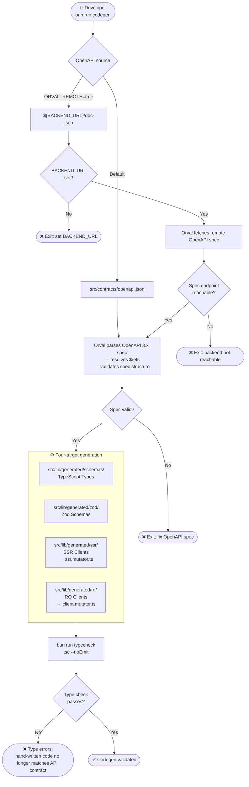
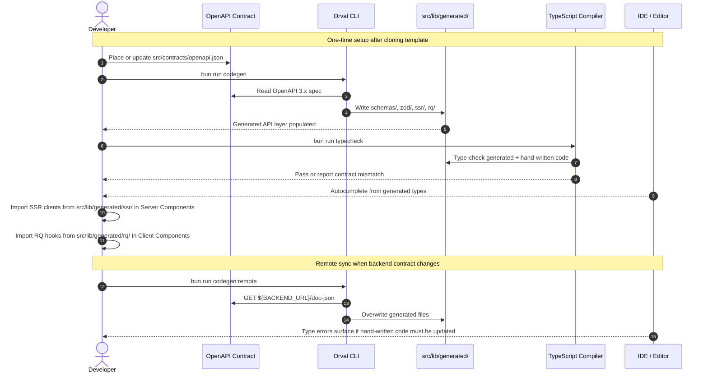

# V10 — Codegen Pipeline

---

## Purpose

The codegen pipeline turns an OpenAPI contract into type-safe frontend data access code. It produces four generated targets:

1. TypeScript API types
2. Zod response validators
3. SSR fetch clients for React Server Components
4. TanStack React Query clients for Client Components

Generated files are build artefacts. They are not edited by hand.

---

## Pipeline Overview



---

## OpenAPI Source Modes

The actual `orval.config.ts` supports two modes:

| Mode | Command | Source | Use case |
|---|---|---|---|
| Local contract | `bun run codegen` | `./src/contracts/openapi.json` | Stable template development, offline-safe generation |
| Remote backend | `bun run codegen:remote` | `${BACKEND_URL}/doc-json` | Syncing against a live backend |
| Validated local generation | `bun run codegen:check` | `./src/contracts/openapi.json` + `tsc --noEmit` | Fast verification after contract updates |

`codegen:watch` is intentionally not documented as a supported script in this version because the repository does not define a watch-mode implementation.

---

## Repository Scripts

```json
{
  "scripts": {
    "typecheck": "tsc --noEmit",
    "codegen": "orval",
    "codegen:remote": "ORVAL_REMOTE=true orval",
    "codegen:check": "bun run codegen && bun run typecheck"
  }
}
```

---

## Dev-Time Workflow — Activity Diagram



---

## `orval.config.ts` Structure

```ts
import { defineConfig } from 'orval'

const OPENAPI_SOURCE = process.env.ORVAL_REMOTE === 'true'
  ? `${process.env.BACKEND_URL}/doc-json`
  : './src/contracts/openapi.json'

export default defineConfig({
  'api-schemas': {
    input: { target: OPENAPI_SOURCE },
    output: {
      mode: 'tags-split',
      target: './src/lib/generated/schemas/',
      client: 'fetch',
    },
  },

  'api-zod': {
    input: { target: OPENAPI_SOURCE },
    output: {
      mode: 'tags-split',
      target: './src/lib/generated/zod/',
      client: 'zod',
    },
  },

  'api-ssr': {
    input: { target: OPENAPI_SOURCE },
    output: {
      mode: 'tags-split',
      target: './src/lib/generated/ssr/',
      client: 'fetch',
      override: {
        mutator: {
          path: './src/lib/api/ssr.mutator.ts',
          name: 'ssrMutator',
        },
      },
    },
  },

  'api-rq': {
    input: { target: OPENAPI_SOURCE },
    output: {
      mode: 'tags-split',
      target: './src/lib/generated/rq/',
      client: 'react-query',
      override: {
        mutator: {
          path: './src/lib/api/client.mutator.ts',
          name: 'clientMutator',
        },
      },
    },
  },
})
```

---

## Output Structure

```
src/lib/generated/              ← DO NOT EDIT
├── schemas/                    ← TypeScript interfaces & types
│   ├── posts.ts
│   ├── users.ts
│   └── index.ts
├── zod/                        ← Zod validators
│   ├── posts.zod.ts
│   ├── users.zod.ts
│   └── index.ts
├── ssr/                        ← Server-side fetch functions
│   ├── posts.ts
│   ├── users.ts
│   └── index.ts
└── rq/                         ← TanStack Query hooks
    ├── posts.ts
    ├── users.ts
    └── index.ts
```

---

## Build Guidance

| Context | Recommended command | Notes |
|---|---|---|
| Local template work | `bun run codegen:check` | Uses local contract and validates TypeScript |
| Sync with live backend | `bun run codegen:remote && bun run typecheck` | Requires `BACKEND_URL` |
| CI with committed local contract | `bun run codegen:check && bun run build` | Backend does not need to be reachable |
| CI against live backend | `bun run codegen:remote && bun run typecheck && bun run build` | Backend must be reachable from CI |

---

## Design Notes

### Local contract is the default

The template defaults to `src/contracts/openapi.json` so the repository remains usable without a live backend. Remote codegen is explicit through `ORVAL_REMOTE=true`.

### Four targets, one contract

All generated targets use the same OpenAPI source. The split exists because server-side rendering and browser-side fetching need different transport boundaries.

### The mutator is the boundary seam

SSR clients use `src/lib/api/ssr.mutator.ts` and call the backend directly from the server. RQ clients use `src/lib/api/client.mutator.ts` and route through the BFF proxy.

### Type errors after codegen are expected signals

If `tsc --noEmit` fails after generation, the OpenAPI contract and hand-written code no longer match. The correct fix is to update the hand-written code or the contract, not to edit generated files.
