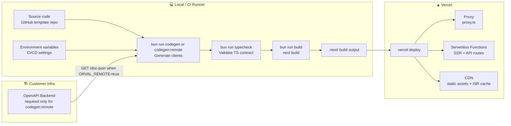

# V11 — Deployment

---

## Structurizr DSL — Deployment Diagram

```structurizr
workspace "bff-pattern" "Deployment View — Production" {

    model {

        # ── Containers (from V2/V6) ─────────────────────────────────────────────
        bffApp = softwareSystem "bff-pattern App" {
            browser = container "Browser" { tags "Client" }
            proxyContainer = container "Proxy" { tags "Server" }
            nextServer = container "Next.js Server" { tags "Server" }
            bffProxy = container "BFF Proxy" { tags "Server" }
            authHandler = container "Auth Handler" { tags "Server" }
        }

        backendApi = softwareSystem "OpenAPI Backend" { tags "External" }
        identityProvider = softwareSystem "Identity Provider" { tags "External" }

        # ── Deployment environments ─────────────────────────────────────────────
        deploymentEnvironment "Production" {

            deploymentNode "User's Browser" {
                description "Chrome, Firefox, Safari — any modern browser."
                technology "Browser"
                containerInstance bffApp.browser
            }

            deploymentNode "Vercel" {
                description "Reference deployment platform for the Next.js application."
                technology "Vercel Platform"

                deploymentNode "Vercel Serverless Functions" {
                    description "Node.js serverless runtime for server rendering and route handlers."
                    technology "Node.js 20 LTS"

                    deploymentNode "Next.js SSR Functions" {
                        description "React Server Components, page rendering, and ISR."
                        containerInstance bffApp.nextServer {
                            description "app/ routes that render Server Components."
                        }
                    }

                    deploymentNode "Route Handler Functions" {
                        description "Next.js route handlers and proxy entry points."
                        containerInstance bffApp.proxyContainer {
                            description "proxy.ts — auth guard and route matching."
                        }
                        containerInstance bffApp.bffProxy {
                            description "app/api/[...proxy]/route.ts"
                        }
                        containerInstance bffApp.authHandler {
                            description "app/api/auth/[...nextauth]/route.ts"
                        }
                    }
                }

                deploymentNode "Vercel CDN" {
                    description "Global content delivery for static assets and cached pages."
                    technology "Vercel Edge Network — Static Layer"
                    infrastructureNode "Static Assets" {
                        description "public/, built CSS, and client JS bundles."
                    }
                    infrastructureNode "ISR Page Cache" {
                        description "Cached statically generated and ISR pages. Revalidated through app/api/revalidate/ when enabled."
                    }
                }
            }

            deploymentNode "Customer Infrastructure" {
                description "Customer-operated systems outside the template boundary."
                technology "Any"

                deploymentNode "Backend Host" {
                    description "Hosts the OpenAPI-compliant backend service."
                    softwareSystemInstance backendApi
                }

                deploymentNode "Identity Provider Host" {
                    description "Hosts the OAuth 2.1 authorization server."
                    softwareSystemInstance identityProvider
                }
            }
        }
    }

    views {

        deployment bffApp "Production" "V9_Deployment" {
            include *
            autoLayout lr
            title "V11 — bff-pattern: Deployment (Production)"
            description "Runtime topology on Vercel and customer infrastructure."
        }

        styles {
            element "Client" {
                background #0e7490
                color #ffffff
                shape WebBrowser
            }
            element "Server" {
                background #1a6bcc
                color #ffffff
            }
            element "External" {
                background #6b7280
                color #ffffff
            }
            element "Infrastructure Node" {
                background #374151
                color #ffffff
                shape Pipe
            }
            relationship "Relationship" {
                thickness 2
            }
        }

        theme default
    }
}
```

---

## Build-to-Deploy Pipeline



---

## Environment Variables

> **Rule:** Only `NEXT_PUBLIC_` variables are safe for the browser bundle. Everything else is server-only. No secret may be exposed through a `NEXT_PUBLIC_` variable.

| Variable | Server-only | Required | Description |
|---|---:|---:|---|
| `BACKEND_URL` | ✅ | Remote codegen / runtime API | Upstream API base URL, for example `https://api.example.com`. Required for `codegen:remote`, SSR calls, and BFF proxy calls. |
| `AUTH_SECRET` | ✅ | ✅ | NextAuth.js JWT signing secret. |
| `AUTH_URL` | ✅ | ✅ | Application base URL used for OAuth callbacks. |
| `AUTH_CLIENT_ID` | ✅ | ✅ | OAuth client ID. |
| `AUTH_CLIENT_SECRET` | ✅ | ✅ | OAuth client secret. |
| `AUTH_ISSUER_URL` | ✅ | ✅ | IdP issuer URL, usually used for OIDC discovery. |
| `AUTH_TOKEN_URL` | ✅ | ✅ | IdP token endpoint for refresh and client-credentials grants. |
| `ALLOWED_ORIGINS` | ✅ | ✅ | Comma-separated allowed origins for BFF CSRF validation. |
| `REVALIDATION_SECRET` | ✅ | Optional | Shared secret for `app/api/revalidate/route.ts`. Required only if the ISR revalidation endpoint is enabled. |
| `ORVAL_REMOTE` | ✅ | Optional | Set to `true` only when codegen should fetch `${BACKEND_URL}/doc-json` instead of `src/contracts/openapi.json`. |
| `NODE_ENV` | ✅ | auto | Runtime mode set by the deployment platform. |

No `NEXT_PUBLIC_` variables are defined by default. Any future public variable must be intentionally reviewed and must not contain credentials, backend URLs, token material, or private infrastructure details.

---

## Runtime Characteristics per Node

| Node | Runtime | Network access | Responsibility |
|---|---|---:|---|
| Proxy | Node.js | ✅ | Runs `proxy.ts`, calls `auth()`, applies coarse route protection |
| Next.js SSR | Node.js | ✅ | Renders Server Components and performs SSR API calls |
| BFF Proxy | Node.js | ✅ | Proxies browser-initiated API calls to the backend |
| Auth Handler | Node.js | ✅ | Handles NextAuth routes, OAuth callbacks, sessions, and refresh |
| CDN / Static | CDN | — | Serves static assets and cached ISR pages |

---

## Design Notes

### Why Vercel as the reference deployment

Vercel maps cleanly to the template's Next.js deployment model: server-side rendering, route handlers, static assets, and ISR cache. The architecture is not Vercel-locked; the same boundaries can run on another Node.js hosting platform.

### `proxy.ts`, not legacy `middleware.ts`

The repo uses `proxy.ts` and `auth()` for route protection. Deployment documentation must therefore describe the proxy as a Node.js runtime boundary, not as an Edge-only middleware boundary.

### ISR revalidation endpoint

`app/api/revalidate/route.ts` may accept webhook calls from the backend and call `revalidatePath()` or `revalidateTag()`. If enabled, the endpoint must validate `REVALIDATION_SECRET` before performing revalidation.

### Client-credentials token cache and serverless instances

`token-manager.ts` uses an in-memory cache per function instance. In serverless environments, multiple instances may each request their own short-lived token. This is acceptable and avoids the need for shared state in the template.

### Secret rotation

Rotating `AUTH_CLIENT_SECRET` or `AUTH_SECRET` requires updating deployment environment variables and redeploying. Rotating `AUTH_SECRET` invalidates existing signed sessions, which logs users out by design.
