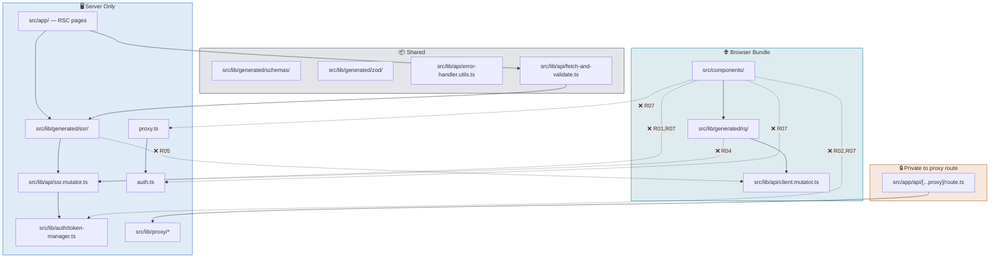

# V12 — Architecture Rules

---

## Rules Overview

These rules make the BFF boundaries machine-checkable with `dependency-cruiser`.

| # | Rule name | Severity | Prohibits | Derived from |
|---|---|---:|---|---|
| R01 | `ssr-mutator-server-only` | error | Client components or generated RQ clients importing `ssr.mutator.ts` | V3, V7 |
| R02 | `token-manager-server-only` | error | Client components importing `token-manager.ts` | V4, V6, V9 |
| R03 | `proxy-internals-private` | error | Importing `lib/proxy/*` from outside `app/api/[...proxy]/route.ts` | V5 |
| R04 | `rq-uses-client-mutator-only` | error | `src/lib/generated/rq/` importing `ssr.mutator.ts` | V3, V7 |
| R05 | `ssr-uses-ssr-mutator-only` | error | `src/lib/generated/ssr/` importing `client.mutator.ts` | V3, V7 |
| R06 | `generated-no-app-imports` | error | Generated files importing from `app/` or `components/` | V7 |
| R07 | `client-components-no-server-only-imports` | error | Client components importing auth/proxy/SSR server-only modules | V2, V3, V6 |
| R08 | `no-direct-generated-in-pages` | warn | `app/` importing generated SSR/RQ clients directly | V7 |

---

## Dependency Boundary Map



---

## `.dependency-cruiser.cjs`

```js
/** @type {import('dependency-cruiser').IConfiguration} */
module.exports = {
  forbidden: [
    {
      name: 'ssr-mutator-server-only',
      comment:
        'ssr.mutator.ts is server-only. It must not be imported by client components or generated RQ clients.',
      severity: 'error',
      from: { path: '^((src/)?components/|(src/)?lib/generated/rq/)' },
      to: { path: '^(src/)?lib/api/ssr\\.mutator\\.ts$' },
    },
    {
      name: 'token-manager-server-only',
      comment:
        'token-manager.ts is server-only. It must not be imported by client components.',
      severity: 'error',
      from: { path: '^(src/)?components/' },
      to: { path: '^(src/)?lib/auth/token-manager\\.ts$' },
    },
    {
      name: 'proxy-internals-private',
      comment:
        'lib/proxy/ modules are private to app/api/[...proxy]/route.ts.',
      severity: 'error',
      from: { pathNot: '^(src/)?app/api/\\[\\.\\.\\.proxy\\]/route\\.ts$' },
      to: { path: '^(src/)?lib/proxy/' },
    },
    {
      name: 'rq-uses-client-mutator-only',
      comment:
        'Generated RQ clients must not import ssr.mutator.ts.',
      severity: 'error',
      from: { path: '^(src/)?lib/generated/rq/' },
      to: { path: '^(src/)?lib/api/ssr\\.mutator\\.ts$' },
    },
    {
      name: 'ssr-uses-ssr-mutator-only',
      comment:
        'Generated SSR clients must not import client.mutator.ts.',
      severity: 'error',
      from: { path: '^(src/)?lib/generated/ssr/' },
      to: { path: '^(src/)?lib/api/client\\.mutator\\.ts$' },
    },
    {
      name: 'generated-no-app-imports',
      comment:
        'lib/generated/ is generated output. It must not import from app/ or components/.',
      severity: 'error',
      from: { path: '^(src/)?lib/generated/' },
      to: { path: '^((src/)?app/|(src/)?components/)' },
    },
    {
      name: 'client-components-no-server-only-imports',
      comment:
        'Client components must not import server-only auth or SSR transport modules.',
      severity: 'error',
      from: { path: '^(src/)?components/' },
      to: {
        path: '^((src/)?lib/api/ssr\\.mutator\\.ts$|(src/)?lib/auth/token-manager\\.ts$|auth\\.ts$|proxy\\.ts$)',
      },
    },
    {
      name: 'no-direct-generated-in-pages',
      comment:
        'Prefer importing SSR clients through lib/api/fetch-and-validate.ts or a thin lib/api facade.',
      severity: 'warn',
      from: { path: '^(src/)?app/' },
      to: { path: '^(src/)?lib/generated/(ssr|rq)/' },
    },
  ],
  options: {
    doNotFollow: { path: 'node_modules' },
    tsPreCompilationDeps: true,
    enhancedResolveOptions: {
      exportsFields: ['exports'],
      conditionNames: ['import', 'require', 'node', 'default'],
    },
    reporterOptions: {
      dot: { collapsePattern: 'node_modules/[^/]+' },
      archi: { collapsePattern: '^(node_modules|src/lib/generated|src/components/ui|components/ui)/[^/]+' },
    },
  },
}
```

---

## `package.json` Scripts

```json
{
  "scripts": {
    "typecheck": "tsc --noEmit",
    "codegen": "orval",
    "codegen:remote": "ORVAL_REMOTE=true orval",
    "codegen:check": "bun run codegen && bun run typecheck",
    "arch:check": "depcruise --config .dependency-cruiser.cjs src proxy.ts auth.ts",
    "arch:graph": "depcruise --config .dependency-cruiser.cjs --output-type dot src proxy.ts auth.ts | dot -T svg > docs/architecture-graph.svg"
  }
}
```

---

## Rules-to-Views Traceability

| Rule | Architecture decision documented in |
|---|---|
| R01 `ssr-mutator-server-only` | V3, V7 |
| R02 `token-manager-server-only` | V4, V6, V9 |
| R03 `proxy-internals-private` | V5 |
| R04 `rq-uses-client-mutator-only` | V3, V7 |
| R05 `ssr-uses-ssr-mutator-only` | V3, V7 |
| R06 `generated-no-app-imports` | V7 |
| R07 `client-components-no-server-only-imports` | V2, V3, V6 |
| R08 `no-direct-generated-in-pages` | V7 |

---

## Verification

Run the architecture rule check after structural changes:

```bash
bun run arch:check
```

For API contract changes, run generation and type validation:

```bash
bun run codegen:check
```
