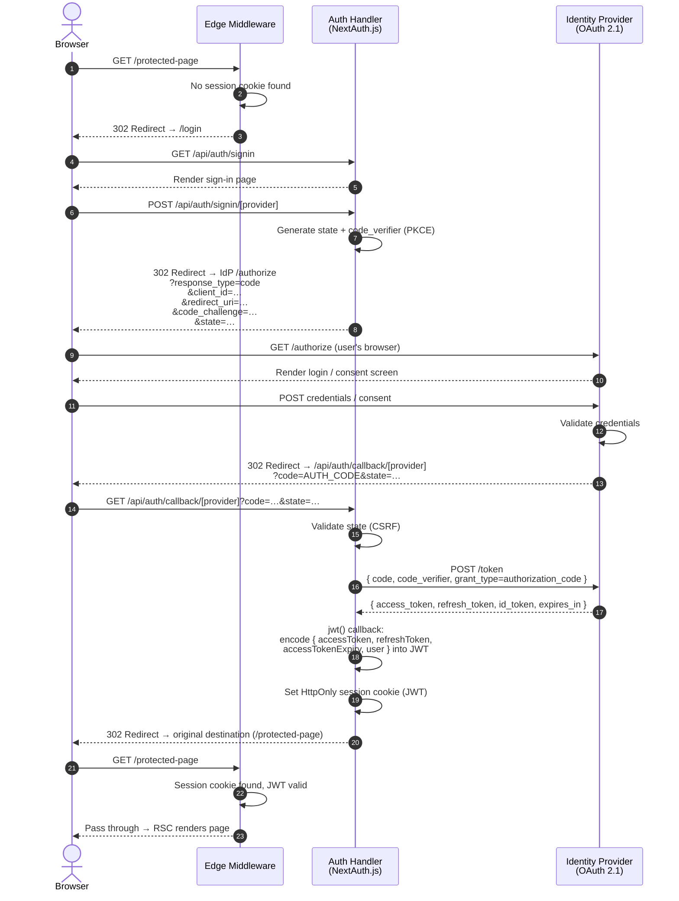
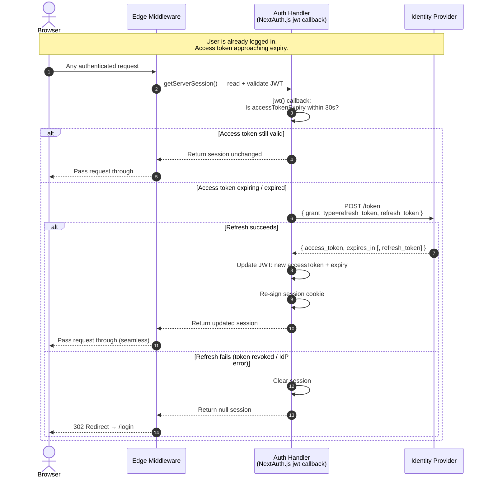
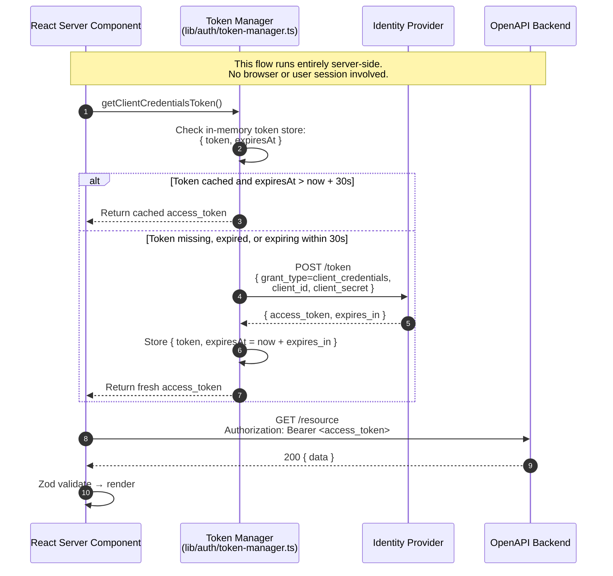

# V4 — Auth Flows

> **sysande view 4 of 10.** Review before moving to V5.
> Render diagrams at https://mermaid.live

---

## Flow 1 — User Login (OAuth 2.1 Authorization Code)

---

## Flow 2 — Silent Access-Token Refresh (within active session)

---

## Flow 3 — Server-Side Client Credentials (RSC token lifecycle)

---

## Token Ownership Table

| Token | Created by | Stored in | Used by | Visible to browser? |
|---|---|---|---|---|
| **User access token** | IdP (Authorization Code flow) | NextAuth JWT session cookie (HttpOnly) | `bffProxy` (injected into upstream calls) | ❌ Never |
| **User refresh token** | IdP (Authorization Code flow) | NextAuth JWT session cookie (HttpOnly) | `authHandler` (silent refresh, Flow 2) | ❌ Never |
| **Client credentials token** | IdP (Client Credentials flow) | In-memory server cache (`token-manager.ts`) | `nextServer` (SSR direct calls) | ❌ Never |
| **NextAuth session JWT** | `authHandler` | HttpOnly cookie | `edgeMiddleware`, `bffProxy`, `nextServer` | ❌ Never (HttpOnly) |

> **Rule:** No token of any kind is ever returned to or readable by the browser.

---

## Design Notes

### Why PKCE even with a confidential client?
OAuth 2.1 mandates PKCE for all Authorization Code flows, including those with client secrets. NextAuth.js 5 handles this automatically. It protects against authorization code interception attacks.

### The 30-second buffer (Flows 2 and 3)
Proactive refresh prevents a race condition where a token expires between the check and the upstream API call. 30 seconds is a practical default — adjustable in `auth.config.ts` and `token-manager.ts`.

### Two completely independent token lifetimes
- **User session** — long-lived (hours/days), governed by IdP's `refresh_token` TTL
- **Client credentials token** — short-lived (minutes), governed by IdP's `expires_in`
They share the same IdP but operate on separate grant flows, separate caches, and separate revocation paths.

### Session cookie is HttpOnly + Secure + SameSite=Lax
NextAuth.js sets these by default. `SameSite=Lax` prevents CSRF on GET requests while allowing top-level navigation. The BFF proxy adds an Origin check for state-changing methods (POST, PUT, DELETE, PATCH) as a second layer.

### What happens on logout
`GET /api/auth/signout` → NextAuth clears the session cookie → Edge Middleware finds no session → protected routes redirect to `/login`. The IdP session is **not** terminated by default (single-sign-out is out of scope for v1).

---

> ✅ Approve to continue to **V5 — BFF Proxy Component** (C4 L3).
> Or request changes to any flow step or design note.
