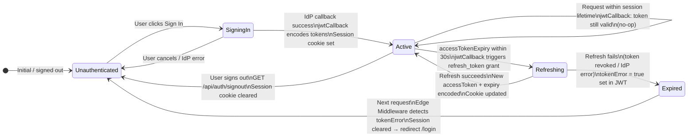

# V6 — Auth Layer: Component View

> **sysande view 6 of 10.** Review before moving to V7.
> Paste DSL into https://playground.structurizr.com/ · Diagrams at https://mermaid.live

---

## Structurizr DSL

```structurizr
workspace "bff-pattern" "Auth Layer — Component View" {

    model {

        # ── External actors ─────────────────────────────────────────────────────
        browser = person "Browser" {
            description "End user navigating login/logout flows."
            tags "External"
        }

        identityProvider = softwareSystem "Identity Provider" {
            description "OAuth 2.1 authorization server."
            tags "External"
        }

        # ── System boundary ─────────────────────────────────────────────────────
        bffApp = softwareSystem "bff-pattern App" {
            tags "Internal"

            edgeMiddleware = container "Edge Middleware" {
                description "middleware.ts — calls auth() to enforce route protection."
                technology "Next.js Middleware"
                tags "Edge"
            }

            bffProxy = container "BFF Proxy" {
                description "app/api/[...proxy]/route.ts"
                technology "Next.js Route Handler"
                tags "Server"
            }

            nextServer = container "Next.js Server" {
                description "React Server Components"
                technology "Next.js 16, RSC"
                tags "Server"
            }

            authHandler = container "Auth Handler" {
                description "NextAuth.js 5 — session management and token lifecycle."
                technology "NextAuth.js 5.0.0-beta.31, OAuth 2.1, JWT"
                tags "Server"

                routeHandler = component "Auth Route Handler" {
                    description "Mounts NextAuth's GET and POST handlers at app/api/auth/[...nextauth]/route.ts. Entry point for all sign-in, sign-out, callback, session, and CSRF token requests."
                    technology "Next.js Route Handler, NextAuth handlers"
                    tags "Component"
                }

                oauthProviderConfig = component "OAuth Provider Config" {
                    description "Declares the OAuth 2.1 provider: authorization URL, token URL, client ID/secret, requested scopes, and profile mapping (how the IdP's user claims map to the session user shape)."
                    technology "NextAuth Provider config, auth.config.ts"
                    tags "Component"
                }

                jwtCallback = component "JWT Callback" {
                    description "Fires on every sign-in and on every session access. Encodes { accessToken, refreshToken, accessTokenExpiry, user } into the signed JWT. When accessTokenExpiry is within 30s, triggers a refresh_token grant against the IdP and updates the encoded values. On refresh failure, marks the session as expired."
                    technology "TypeScript, callbacks.jwt in auth.config.ts"
                    tags "Component"
                }

                sessionCallback = component "Session Callback" {
                    description "Shapes the object returned by getServerSession(). Exposes: user profile fields (id, name, email, role) and a boolean tokenError flag. Does NOT expose raw access or refresh tokens to calling code."
                    technology "TypeScript, callbacks.session in auth.config.ts"
                    tags "Component"
                }

                authorizedCallback = component "Authorized Callback" {
                    description "Called by Edge Middleware via the auth() wrapper. Receives the session and the incoming request. Returns true to allow the request through, or false to redirect to the configured login page. Implements public-route allowlist matching."
                    technology "TypeScript, callbacks.authorized in auth.config.ts"
                    tags "Component"
                }

                tokenManager = component "Token Manager" {
                    description "Manages the server-side client credentials token independently of the user session. Maintains an in-memory cache { token, expiresAt }. getClientCredentialsToken() returns the cached token or fetches a fresh one from the IdP using the Client Credentials grant. Proactive 30s refresh buffer."
                    technology "TypeScript, lib/auth/token-manager.ts"
                    tags "Component"
                }
            }
        }

        # ── Relationships ───────────────────────────────────────────────────────

        # Browser entry points into Auth Handler
        browser -> routeHandler "GET/POST /api/auth/* (sign-in, callback, sign-out)"

        # Internal callback chain (sign-in flow)
        routeHandler -> oauthProviderConfig "Reads provider settings"
        routeHandler -> jwtCallback         "Invokes on token creation / refresh"
        jwtCallback -> sessionCallback      "Passes JWT payload for session shaping"

        # IdP interactions
        routeHandler -> identityProvider    "Redirects browser for authorization"
        jwtCallback  -> identityProvider    "POST /token (refresh_token grant)"
        tokenManager -> identityProvider    "POST /token (client_credentials grant)"

        # Consumers of Auth Handler
        edgeMiddleware -> authorizedCallback "auth() — route protection check"
        bffProxy       -> sessionCallback    "getServerSession() — read user token"
        nextServer     -> sessionCallback    "getServerSession() — read session data"
        nextServer     -> tokenManager       "getClientCredentialsToken() — SSR calls"
        bffProxy       -> tokenManager       "getClientCredentialsToken() — public whitelist"
    }

    views {

        component authHandler "V6_AuthLayerComponent" {
            include *
            autoLayout tb
            title "V6 — Auth Layer: Component View"
            description "The 6 components inside the Auth Handler and their consumers."
        }

        styles {
            element "Component" {
                background #1a6bcc
                color #ffffff
                shape Component
            }
            element "External" {
                background #6b7280
                color #ffffff
                shape RoundedBox
            }
            element "Edge" {
                background #7c3aed
                color #ffffff
                shape RoundedBox
            }
            element "Server" {
                background #374151
                color #ffffff
                shape RoundedBox
            }
            element "Person" {
                background #374151
                color #ffffff
                shape Person
            }
            relationship "Relationship" {
                thickness 2
            }
        }

        theme default
    }
}
```

---

## Session Lifecycle — State Diagram



---

## Callback Reference Table

| Callback | File | Fires when | Input | Output |
|---|---|---|---|---|
| `jwt()` | `auth.config.ts` | Sign-in; every session access; token refresh | Raw IdP tokens + existing JWT | Updated JWT (stored in cookie) |
| `session()` | `auth.config.ts` | `getServerSession()` called | JWT payload | Safe session object (no raw tokens) |
| `authorized()` | `auth.config.ts` | Edge Middleware `auth()` runs | Session + Request | `true` (allow) / `false` (redirect) |

---

## Component → File Placement

| Component | File |
|---|---|
| Auth Route Handler | `app/api/auth/[...nextauth]/route.ts` |
| OAuth Provider Config | `auth.config.ts` → `providers[]` |
| JWT Callback | `auth.config.ts` → `callbacks.jwt` |
| Session Callback | `auth.config.ts` → `callbacks.session` |
| Authorized Callback | `auth.config.ts` → `callbacks.authorized` |
| Token Manager | `lib/auth/token-manager.ts` |
| NextAuth initialiser | `auth.ts` (imports auth.config, exports `auth`, `handlers`) |

> **Note on `auth.ts` vs `auth.config.ts`:**
> NextAuth 5 requires splitting config from initialisation to support Edge Runtime.
> `auth.config.ts` — plain config object, Edge-compatible (no Node.js APIs).
> `auth.ts` — calls `NextAuth(authConfig)`, exports `{ auth, handlers, signIn, signOut }`.
> Edge Middleware imports from `auth.config.ts` only. Everything else imports from `auth.ts`.

---

## Design Notes

### Session callback never exposes raw tokens
The `session()` callback deliberately omits `accessToken` and `refreshToken` from the returned object. Server code that needs the access token reads it directly from the JWT via `getServerSession()` using an internal accessor — it is never accessible from client-side code or exposed via the `/api/auth/session` endpoint.

### Token Manager is independent of user sessions
`token-manager.ts` holds no reference to NextAuth internals. It is a pure server-side utility: a singleton module-level cache with a `getClientCredentialsToken()` function. This makes it testable in isolation and usable without any user being logged in.

### `authorized()` vs route-level session checks
`authorized()` in Edge Middleware handles coarse-grained route protection (public vs. protected paths). Fine-grained authorisation (role checks, resource ownership) happens inside Server Components or the BFF Proxy after `getServerSession()` — not in the middleware.

### `auth.config.ts` must remain Edge-compatible
The `authorized()` callback runs in the Vercel Edge Runtime. This means `auth.config.ts` must not import any Node.js built-ins (`fs`, `crypto`, `http`). The `token-manager.ts` (which uses in-memory caching) is Node-only and must never be imported from `auth.config.ts`.

---

> ✅ Approve to continue to **V7 — Data Layer Component** (C4 L3).
> Or request changes to components, callbacks, or the session state diagram.
