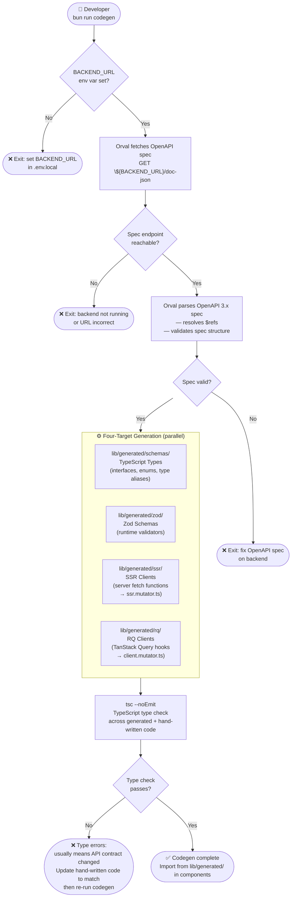
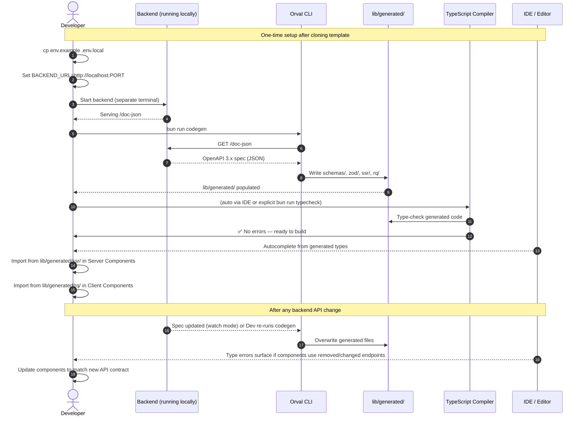

# V8 — Codegen Pipeline

> **sysande view 8 of 10.** Review before moving to V9.
> Render diagrams at https://mermaid.live

---

## Pipeline Overview



---

## When to Run

| Trigger | Command | Notes |
|---|---|---|
| **Initial project setup** | `bun run codegen` | Backend must be running and accessible |
| **Backend API changed** | `bun run codegen` | Regenerates all four targets; update components if types changed |
| **Active backend development** | `bun run codegen:watch` | Watches spec endpoint; re-generates on change |
| **CI/CD deploy pipeline** | `bun run codegen && bun run build` | Codegen runs before build; backend must be reachable from CI |
| **After deleting `lib/generated/`** | `bun run codegen` | Full regeneration; TypeScript will fail until complete |

---

## Dev-Time Workflow — Activity Diagram



---

## `orval.config.ts` Structure

```ts
// orval.config.ts — root of the project
import { defineConfig } from 'orval'

export default defineConfig({

  // Target 1: TypeScript types
  'api-schemas': {
    input: {
      target: `${process.env.BACKEND_URL}/doc-json`,
    },
    output: {
      mode: 'tags-split',           // one file per API tag
      target: 'lib/generated/schemas/',
      client: 'fetch',
      override: {
        mutator: { path: 'lib/api/ssr.mutator.ts', name: 'ssrMutator' },
      },
    },
  },

  // Target 2: Zod runtime validators
  'api-zod': {
    input: {
      target: `${process.env.BACKEND_URL}/doc-json`,
    },
    output: {
      mode: 'tags-split',
      target: 'lib/generated/zod/',
      client: 'zod',
    },
  },

  // Target 3: SSR fetch clients (server-side direct calls)
  'api-ssr': {
    input: {
      target: `${process.env.BACKEND_URL}/doc-json`,
    },
    output: {
      mode: 'tags-split',
      target: 'lib/generated/ssr/',
      client: 'fetch',
      override: {
        mutator: { path: 'lib/api/ssr.mutator.ts', name: 'ssrMutator' },
      },
    },
  },

  // Target 4: TanStack React Query hooks (client-side BFF-routed calls)
  'api-rq': {
    input: {
      target: `${process.env.BACKEND_URL}/doc-json`,
    },
    output: {
      mode: 'tags-split',
      target: 'lib/generated/rq/',
      client: 'react-query',
      override: {
        mutator: { path: 'lib/api/client.mutator.ts', name: 'clientMutator' },
      },
    },
  },
})
```

---

## Output Structure

```
lib/
└── generated/               ← DO NOT EDIT (gitignore or regenerate on deploy)
    ├── schemas/             ← TypeScript interfaces & types
    │   ├── posts.ts
    │   ├── users.ts
    │   └── index.ts
    ├── zod/                 ← Zod validators
    │   ├── posts.zod.ts
    │   ├── users.zod.ts
    │   └── index.ts
    ├── ssr/                 ← Server-side fetch functions
    │   ├── posts.ts
    │   ├── users.ts
    │   └── index.ts
    └── rq/                  ← TanStack Query hooks
        ├── posts.ts
        ├── users.ts
        └── index.ts
```

---

## `.gitignore` and Deployment Guidance

```gitignore
# Codegen output — regenerated from backend spec at build time
lib/generated/
```

> **Deployment pipeline must run codegen before build:**
> ```bash
> bun run codegen && bun run build
> ```
> The backend must be reachable from the CI/CD environment at build time.
> Store `BACKEND_URL` as a CI/CD secret — not in the repository.

---

## Design Notes

### Four targets, one spec fetch per target
Orval fetches the spec once per target definition. For efficiency in CI, all four targets share the same `input.target` URL. A future optimisation is to download the spec once to a local file (`spec.json`) and point all targets at it — avoiding four network calls to the backend.

### `mode: 'tags-split'` keeps generated files manageable
Without splitting, Orval generates a single large file per target. `tags-split` creates one file per OpenAPI tag (e.g. `posts.ts`, `users.ts`), matching the backend's resource organisation and making diffs easier to review after backend changes.

### Watch mode is for development only — not CI
`bun run codegen:watch` polls the spec endpoint. It should never run in production or CI environments. Use a single `bun run codegen` in the deployment pipeline.

### TypeScript errors after codegen signal a breaking change
If `tsc --noEmit` fails after codegen, it means the backend removed or renamed an endpoint or field that hand-written code depends on. This is intentional — it surfaces breaking API changes at build time rather than at runtime.

---

> ✅ Approve to continue to **V9 — Deployment**.
> Or request changes to the pipeline flow, orval config structure, or output layout.
