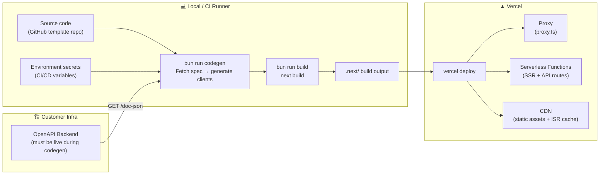

# V9 — Deployment

---

## Structurizr DSL — Deployment Diagram

```structurizr
workspace "bff-pattern" "Deployment View — Production" {

    model {

        # ── Containers (from V2) ────────────────────────────────────────────────
        bffApp = softwareSystem "bff-pattern App" {
            browser       = container "Browser"       { tags "Client" }
            proxyContainer = container "Proxy" { tags "Server" }
            nextServer    = container "Next.js Server" { tags "Server" }
            bffProxy      = container "BFF Proxy"     { tags "Server" }
            authHandler   = container "Auth Handler"  { tags "Server" }
        }

        backendApi        = softwareSystem "OpenAPI Backend"   { tags "External" }
        identityProvider  = softwareSystem "Identity Provider" { tags "External" }

        # ── Deployment environments ─────────────────────────────────────────────
        deploymentEnvironment "Production" {

            deploymentNode "User's Browser" {
                description "Chrome, Firefox, Safari — any modern browser."
                technology "Browser"
                containerInstance bffApp.browser
            }

            deploymentNode "Vercel" {
                description "Primary deployment platform."
                technology "Vercel Platform"

                deploymentNode "Vercel Serverless Functions" {
                    description "On-demand Node.js functions. Cold start: ~100–300ms. Max duration: 10s (Hobby) / 60s (Pro)."
                    technology "Node.js 20 LTS — Bun runtime (via custom build)"

                    deploymentNode "Next.js SSR Functions" {
                        description "React Server Components, page rendering, ISR."
                        containerInstance bffApp.nextServer {
                            description "app/(public)/, app/(secure)/ — RSC page routes."
                        }
                    }

                    deploymentNode "API Functions" {
                        description "Next.js API routes — BFF proxy, auth, and route proxy."
                        containerInstance bffApp.proxyContainer {
                            description "proxy.ts — auth guard, route matching."
                        }
                        containerInstance bffApp.bffProxy {
                            description "app/api/[...proxy]/route.ts"
                        }
                        containerInstance bffApp.authHandler {
                            description "app/api/auth/[...nextauth]/route.ts"
                        }
                    }
                }

                deploymentNode "Vercel CDN" {
                    description "Global content delivery. Serves static assets and cached pages. Latency: ~10–50ms."
                    technology "Vercel Edge Network — Static Layer"
                    infrastructureNode "Static Assets" {
                        description "public/, built CSS, client JS bundles (_next/static/). Cache-Control: immutable."
                    }
                    infrastructureNode "ISR Page Cache" {
                        description "Cached statically-generated and ISR pages. Revalidated via app/api/revalidate/ on backend webhook."
                    }
                }
            }

            deploymentNode "Customer Infrastructure" {
                description "Customer-operated. Not part of the template — any hosting platform."
                technology "Any"

                deploymentNode "Backend Host" {
                    description "Hosts the OpenAPI-compliant backend service."
                    softwareSystemInstance backendApi
                }

                deploymentNode "Identity Provider Host" {
                    description "Hosts the OAuth 2.1 authorization server."
                    softwareSystemInstance identityProvider
                }
            }
        }
    }

    views {

        deployment bffApp "Production" "V9_Deployment" {
            include *
            autoLayout lr
            title "V9 — bff-pattern: Deployment (Production)"
            description "Runtime topology on Vercel and customer infrastructure."
        }

        styles {
            element "Client" {
                background #0e7490
                color #ffffff
                shape WebBrowser
            }
            element "Edge" {
                background #7c3aed
                color #ffffff
            }
            element "Server" {
                background #1a6bcc
                color #ffffff
            }
            element "External" {
                background #6b7280
                color #ffffff
            }
            element "Infrastructure Node" {
                background #374151
                color #ffffff
                shape Pipe
            }
            relationship "Relationship" {
                thickness 2
            }
        }

        theme default
    }
}
```

---

## Build-to-Deploy Pipeline



---

## Environment Variables

> **Rule:** Only `NEXT_PUBLIC_` variables are safe for the browser bundle. Everything else is server-only. No secrets ever appear in `NEXT_PUBLIC_` names.

| Variable | Server-only | Required | Description |
|---|---|---|---|
| `BACKEND_URL` | ✅ | ✅ | Upstream API base URL (`https://api.example.com`) |
| `AUTH_SECRET` | ✅ | ✅ | NextAuth.js JWT signing secret (32+ random bytes) |
| `AUTH_URL` | ✅ | ✅ | Application base URL (`https://app.example.com`) — used for OAuth callbacks |
| `AUTH_CLIENT_ID` | ✅ | ✅ | OAuth 2.1 client ID |
| `AUTH_CLIENT_SECRET` | ✅ | ✅ | OAuth 2.1 client secret |
| `AUTH_ISSUER_URL` | ✅ | ✅ | IdP issuer URL (for `.well-known/openid-configuration`) |
| `AUTH_TOKEN_URL` | ✅ | ✅ | IdP token endpoint (for client credentials grant) |
| `ALLOWED_ORIGINS` | ✅ | ✅ | Comma-separated list of allowed origins for CSRF validation |
| `NODE_ENV` | ✅ | auto | Set by Vercel automatically (`production` / `development`) |

> ⚠️ No `NEXT_PUBLIC_` variables are defined by default. If the application ever needs a public variable (e.g. analytics ID), it must contain **no secret** and must be intentionally declared.

---

## Runtime Characteristics per Node

| Node | Runtime | Max memory | Cold start | Network access |
|---|---|---|---|---|
| Proxy | Node.js 20 | 1 GB | ~100–300ms | ✅ Full — calls backend + IdP |
| Next.js SSR | Node.js 20 | 1 GB | ~100–300ms | ✅ Full — calls backend + IdP |
| BFF Proxy | Node.js 20 | 1 GB | ~100–300ms | ✅ Full — calls backend |
| Auth Handler | Node.js 20 | 1 GB | ~100–300ms | ✅ Full — calls IdP |
| CDN / Static | — | — | None | — |

> **Proxy runtime:** `proxy.ts` runs on Node.js by default in Next.js 16. This allows NextAuth to be fully consolidated in `auth.ts` without Edge-compatibility constraints.

---

## Design Notes

### Why Vercel as the reference deployment
Vercel is the natural fit for Next.js: zero-config Edge Middleware, ISR, and serverless functions map directly to the template's containers. The template is not Vercel-locked — the same architecture runs on any Node.js host (Railway, Fly.io, self-hosted Docker), but the deployment DSL and environment variable guide use Vercel as the reference.

### ISR revalidation endpoint
`app/api/revalidate/route.ts` accepts webhook calls from the backend (e.g. on content publish). It calls `revalidatePath()` or `revalidateTag()` to purge the ISR cache. This keeps the CDN cache fresh without requiring a full redeploy. The endpoint is protected by a shared secret (`REVALIDATION_SECRET`).

### Client credentials token cache and serverless cold starts
The token-manager.ts in-memory cache is **per function instance**. In serverless environments, multiple concurrent instances may each hold their own cached token. This is acceptable — the IdP receives multiple valid token requests but all are short-lived client credentials tokens. No shared state is needed.

### Secret rotation
Rotating `AUTH_CLIENT_SECRET` or `AUTH_SECRET` requires a Vercel environment variable update and a redeployment. Existing user sessions signed with the old `AUTH_SECRET` will be invalidated — users will be logged out. This is a deliberate security property, not a bug.

---

> ✅ Approve to continue to **V10 — Architecture Rules** (dependency-cruiser).
> Or request changes to the deployment topology, environment variables, or runtime notes.
